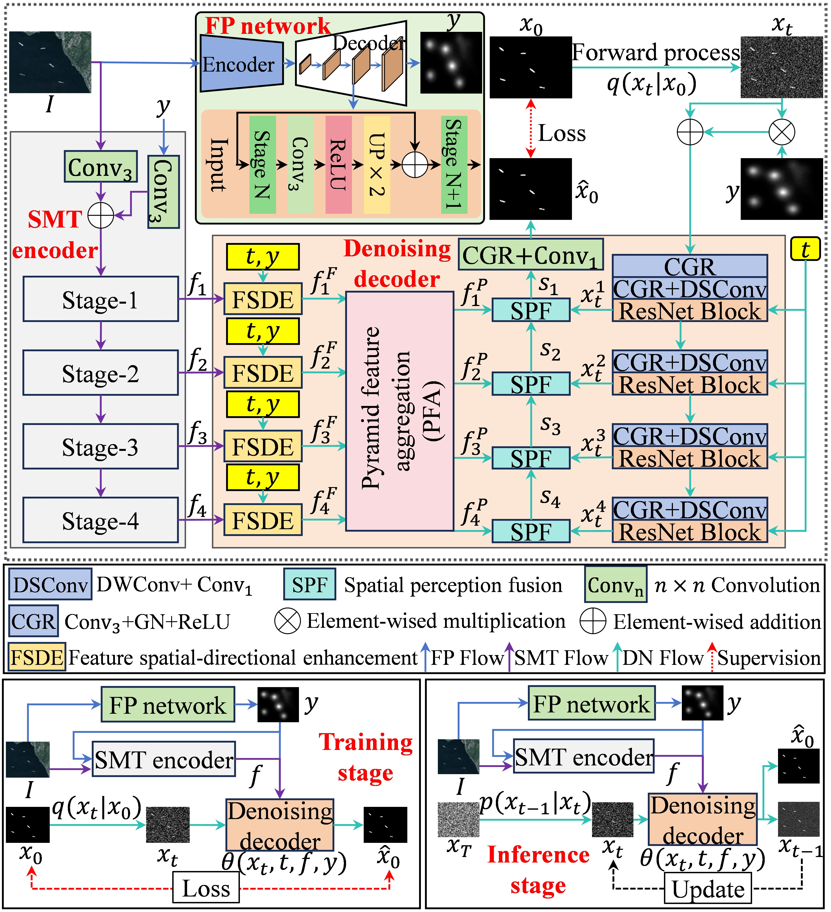
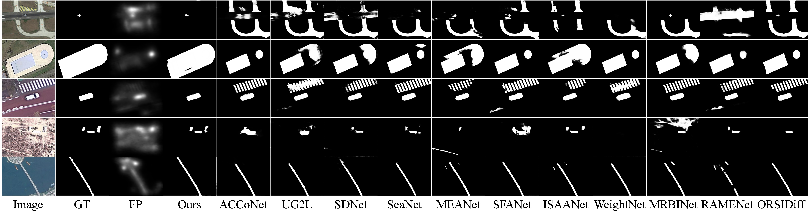

# FGDiff []

Official implementation of [FGDiff](https://ieeexplore.ieee.org/document/11303205).

**[Fixation-Guided Diffusion for Salient Object Detection in Optical Remote Sensing Images](https://ieeexplore.ieee.org/document/11303205)**
<br/>
[Yang Shui](), 
[Yajun Chang](), 
[Zelong Wang*](),
<br/>

## 📣 Highlight
- FGDiff is accepted by  **IEEE Geoscience and Remote Sensing Letters**.
- FGDiff is a framework that integrates fixation prediction prior with a conditional diffusion model.


## Abstract
Salient object detection (SOD) for optical remote sensing images (RSIs) still faces inaccurate localization and sensitivity to edge variations. In this letter, we propose FGDiff, a framework that integrates fixation prediction (FP) prior with a conditional diffusion model. First, FP maps from a lightweight FP network are utilized to identify the potential object regions. Second, a lightweight hybrid backbone encoder then couples FP priors with multiscale features. It incorporates the feature spatial–directional enhancement (FSDE) module to strengthen spatial and directional awareness while integrating the time steps and FP priors prompts for dynamic spatial perception. The pyramid feature aggregation (PFA) module recursively aggregates contextual multiscale information. Finally, the spatial perception fusion (SPF) module within the denoising decoder jointly optimizes image and mask features in a spatially adaptive manner, enabling iterative fine-grained refinement of salient objects. Comparison experiments on the ORSSD, EORSSD, and ORSI-4199 datasets demonstrate that FGDiff outperforms the state-of-the-art methods in detection accuracy and edge preservation, validating its effectiveness for RSI-SOD. The code is available at https://github.com/23shuiyang/FGDiff.
<td style="border: 1cm; text-align: center;">
  
</td>

```bash
conda create -n FGDiff
conda activate FGDiff
pip install -r requirements.txt
```

## Datasets
Put the datasets into *./datasets*
- ORSSD
- EORSSD
- ORSI-4199

## visual results
Visual comparisons with the start-of-the-art methods on the five challenging scenarios from ORSI-4199 dataset.
<td style="border: none; text-align: center;">
  
</td>

## BibTeX
```
@ARTICLE{shui2026GRSL,
  author={Shui, Yang and Chang, Yajun and Wang, Zelong},
  journal={IEEE Geoscience and Remote Sensing Letters}, 
  title={Fixation-Guided Diffusion for Salient Object Detection in Optical Remote Sensing Images}, 
  year={2026},
  volume={23},
  pages={1-5},
  doi={10.1109/LGRS.2025.3645693}}
```